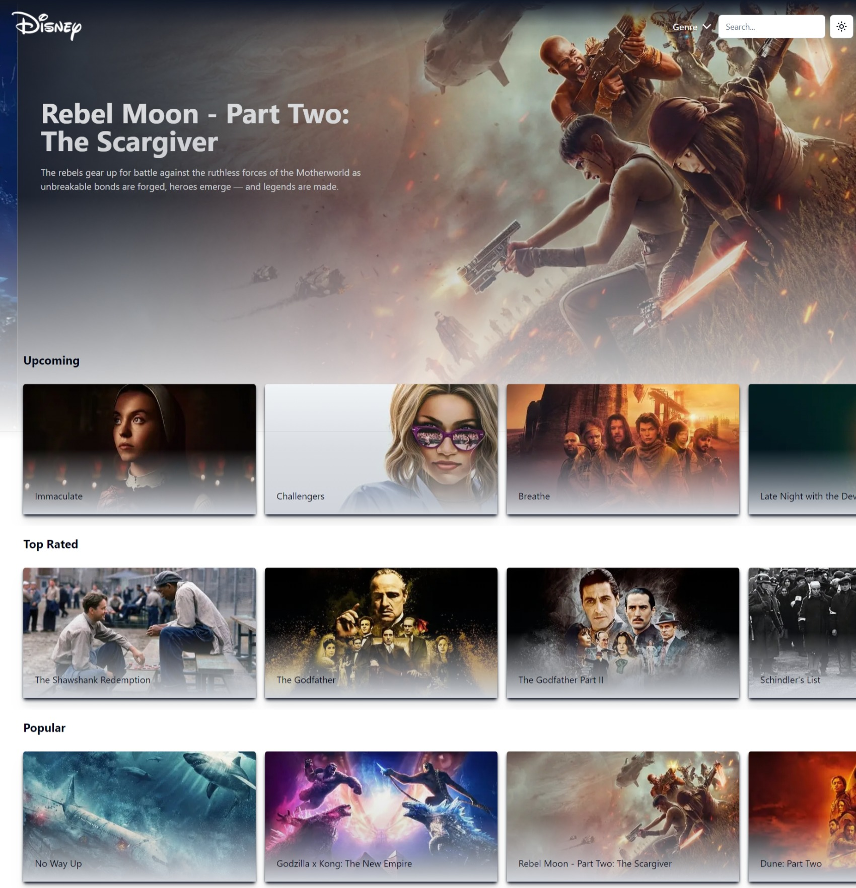
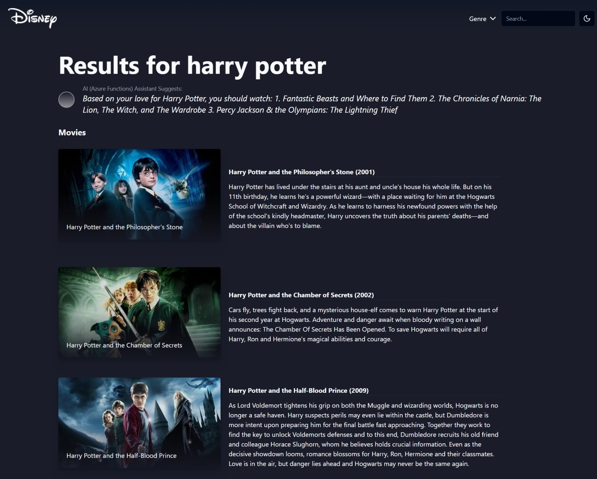
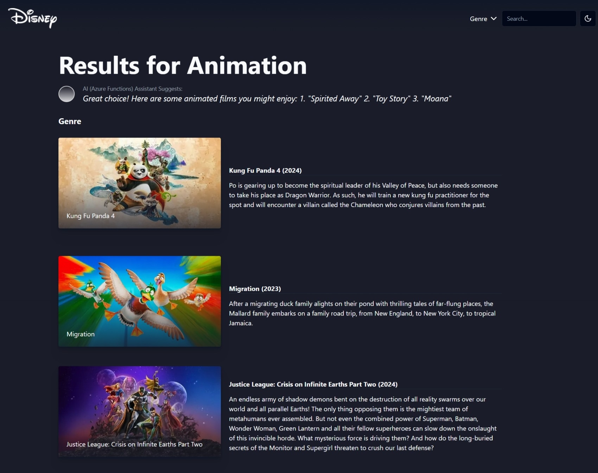

# Disney+ with Next.js 14, Azure Functions, OpenAI

Dark Mode

Light mode

Search Page

Genres Page

MovieDetails Page

## Technologies Used

- Shadcn
- Azure Functions
- Azure OpenAI service
- Next.js 14
- Tailwind CSS
- TypeScript
- Vercel

## Features

- Beautiful UI & UX design
- Azure Functions for powerful backend functionality
- Azure OpenAI service for AI movie suggestions and completions
- Loaders for a seamless user experience during data fetching
- Next.js 14 for efficient data caching
- Tailwind CSS for stunning UI design
- Dark Mode toggling for user preference
- TypeScript for bug reduction
- Deployment on Vercel for a scalable and fast web application
